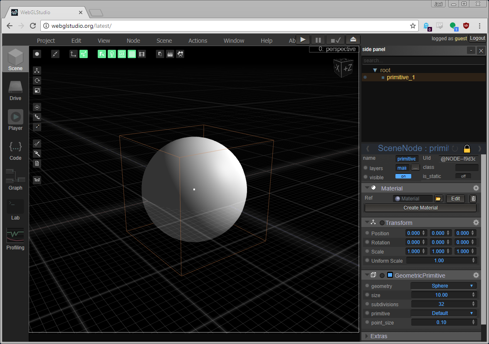
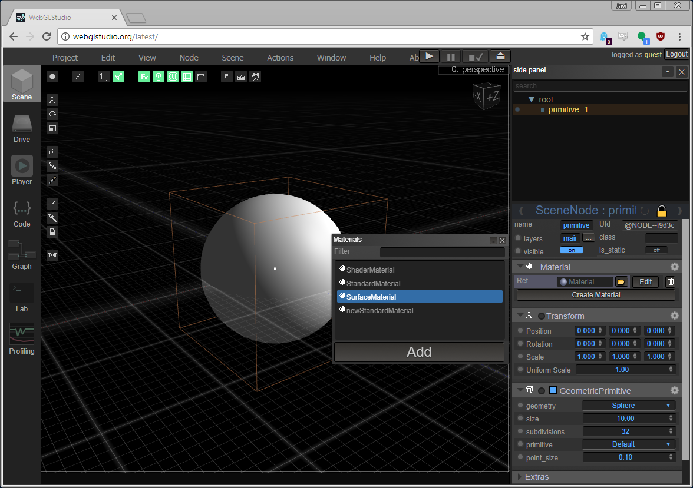
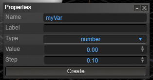

# Creating a Shader

In this guide we will see how to create a shader from scratch using the WebGLStudio editor.

# Setting up the scene

First we need a mesh to render in our scene, so drag any OBJ to the canvas or load one from the Drive.

If you dont have any mesh you can create a primitive using the menu: ```Node -> Primitive -> Sphere```.



# Creating a Material

There are two materials that allow you to code your own shader:

- ```SurfaceMaterial```: Where you fill in the properties of every pixel of the surface (Albedo, Emission, Normal, etc) and the system does the rest.
- ```ShaderMaterial```: Where you must code the shader from scratch (it gives you more freedom but it could be harder to integrate with all the engine features).

Lets start with the SurfaceMaterial, but if you want to code your shader from scratch go directly to the [guide to create shaders](https://github.com/jagenjo/litescene.js/blob/master/guides/shaders.md).

To create the material click in the node, and in the inspector panel on the right, click "Create Material" and choose ```SurfaceMaterial``` then click Add.



# Creating a SurfaceMaterial

Now we have the material we can edit the properties by clicking "See properties" in the material.

In this panel we can add properties that the shader will use (data that must be sent to the shader, if you know shaders this will be the uniforms that we pass).

By default the shader has a color property but you can add many more.

To add a property click Add Property:



The fields are:

- __name__: The name of the uniform in the shader. I suggest start with "u_" to denote its type and avoid name collision: "u_brightness"
- __label__: The title to show in the inspector when showing this property, it omitted the name will be used.
- __type__: the type of the property/uniform
- __value__: the default value
- extras: some properties may have some extras like step for numbers, etc.

Once you have set up the properties you want to edit the surface shader, to do so click the button __Edit Shader__.

Here you can edit the GLSL code for the shader. You have access to all the properties defined previously.

The input of this function is two objects, one that define mesh properties, the other where you assign surface properties.

For the Input:

- ```vec3 vertex```: vertex position in local space
- ```vec3 normal```: vertex normal
- ```vec2 uv```: primary texture coordinates
- ```vec2 uv1```: secondary uvs
- ```vec4 color```: color of the vertex (if there are)
- ```vec3 camPos```: camera global position
- ```vec3 viewDir```: view vector (vector from pixel to camera)
- ```vec3 worldPos```: pixel in world space
- ```vec3 worldNormal```: normal in world space
- ```vec4 screenPos```: pixel in screen coordinates

This values should be modifyed and are only to be read.

For the output we use ```SurfaceOutput```:

- ```vec3 Albedo```: the color of the surface
- ```vec3 Normal```: the final normal of the surface (in case we want to modify it like using normalmaps)
- ```vec3 Emission```: the amount of light emittied by this pixel
- ```vec3 Ambient```: the amount of ambient reflected by this pixel
- ```float Specular```: the amount of specular reflected
- ```float Gloss```: the glossiness of the pixel
- ```float Alpha```: the transparency
- ```float Reflectivity```: the amount of reflection
- ```vec4 Extra```:  for special purposes

You don't need to define every single property of the SurfaceOutput structure, the already have a default value.

# Creating a ShaderMaterial

ShaderMaterials allow you to use shaders created from scratch. Once created the material you must assign a shader from a file or create a new one.

If you want to create a new one just click the ```{}``` button. By default you will see some templates that you could use. To start we suggest to use the flat one.

Once created you will see a file with different sections sepparated by a back-slash with a given name.

It is important to note that there is one with the name ```\js```. This one is important because it allows you to define the uniforms that should be exported from the shader.

To do so you must use the next syntax:

```js
this.createUniform("Refaction","u_refraction_factor","number",0.02, { precision: 3, step: 0.001 });
this.createSampler("Colorbuff","u_texture",null,":color_buffer");
```

For more info about creating the shader check the [guide to create shaders](https://github.com/jagenjo/litescene.js/blob/master/guides/shaders.md).


