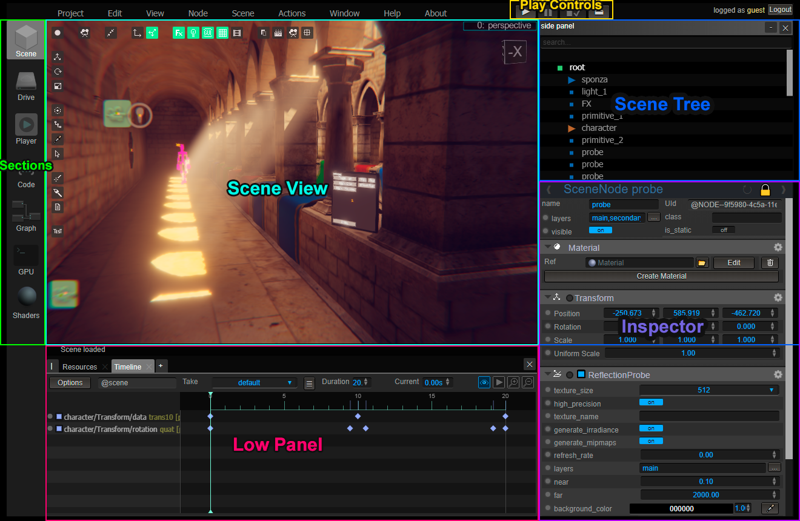

# Tutorial

In this guide we will see the first steps to create an interactive application using WebGLStudio.

During this guide we will try to step in the most common steps that every user will encounter.

Lets start

# The interface

The current interface of the editor is still in an alpha state, it is not as intuitive as we would like to but this will be addressed
in future updates.



There are several areas in the interface:
- **Scene View** where you can see the 3D area of your project
- **Scene Tree** a list of all the nodes of the scene
- **Inspector** the place where the properties of the selected object are shown
- **Play Controls** to launch the project
- **Sections** buttons to change between sections of the app
- **Low panel** multi-use panel that can be hide


# Sections

The editor is divided in six sections that you can access through the buttons in the left side:

- **Scene**: to edit/view the current scene 
- **Drive**: to manage files (on the server or in memory)
- **Player**: to view the final result of your application
- **Code**: to edit the scripts in your scene
- **Graph**: to edit the graphs in your scene
- **GPU**: to check the resources stored in the GPU


# SceneTree, SceneNodes and Components

Before going into detail on how to use the editor it is important to understand the basics about how a scene is created.

To create our interactive application using WebGLStudio we need to create an Scene. A scene contains all the visible objects (meshes, materials) and all the behaviour (scripts, graphs).

To store our project we just save the scene as it contains everything.
(In the future maybe we will have another class on top of the scene called Project in case we want to load several scenes...).

The scene is contained in a ```LS.Scene``` class, and it can only be one active (although there are some tricks to have more than one using special components).

The scene contains ```LS.SceneNode``` that represent objects in our scene, and every scene node also could contain inside other nodes, 
creating what is known as an [scene graph](https://en.wikipedia.org/wiki/Scene_graph) (not to be confused with the behaviour graphs in our system).

Scene nodes by themselves do not have any behaviour, to add them behaviour (draw something, interact with the user...) we need to attach components to them.

```LS.Component``` is the base class of every component in the system. There are components for many things, check the [guide about components](components.md) to know more about them.

To know more about the nodes structure check the [guide about Scenes](https://github.com/jagenjo/litescene.js/blob/master/guides/scene.md).

# Creating an object

Let's create an sphere, to do this click on the menu ```Node -> Primitive -> Sphere```.

A new node will appear in the node tree, and we inspect it we will see it contains a ```Transform```that handles its position,rotation and scale into the scene, and a ```GeometricPrimitive``` component in charge of rendering the sphere.

You can create more nodes, and attach components to give more behaviours. Drag meshes from the Drive or your harddrive, add lights, play with the materials, till the scene looks the way you like.

# Adding some behaviour

Now let's create an script to change its behaviour, to do this click in the button ```Add Behaviour -> Inner script``` in the inspector of the sphere node.

Now we have an empty script attached to this node, we can use scripts to control how the objects behave or to control the user interactions.

After creating the script the editor will switch automatically to the Code tab, and open the code of the script.

To know more about how to code inside WebGLStudio check the [guide to scripting in LiteScene](https://github.com/jagenjo/litescene.js/blob/master/guides/scripting.md)

To test the application now we can create a very simple script:

```js
//@sine movement
this.onUpdate = function(dt)
{
	node.transform.y = Math.sin( scene.time ) * 50;
	node.scene.refresh();
}
```

After writing an script, press the compile button (or control + enter) to evaluate it.

# Setting the final camera

Now we want to be sure the final project will be shown from the right camera position, so we need to configure the main camera.

Select the root node in the scene tree, and you will see in the inspector a component named Camera. Here you will have lots of parameters to control the final camera, if you want to see the scene from that camera you can click the tab Player in the left side of the editor. 

If you are in the Scene Editor and  you want to copy the current view to the Camera, inside the Camera component you will see a button named "Copy from View", click that button to move the camera to the same position as your actual view.

# Testing the application

Now we want to run our application, to do that let's press the Play button on top of the editor.

When testing your application you can switch to the Player tab to see how the user will see once it is finished.

# Saving and sharing

Now we have a simple example, let's save our scene using the ```Project -> Save in server```. 
Remember that you need to have an account created in the server.

Once save it you are ready to share it, click ```Project -> Publish``` and then ```Publish``` to open a window with your project.

# Final thoughts

We understand this tutorial is very basic, to know more about the posibilities of the engine, please check the [guides about LiteScene](https://github.com/jagenjo/litescene.js/tree/master/guides).


